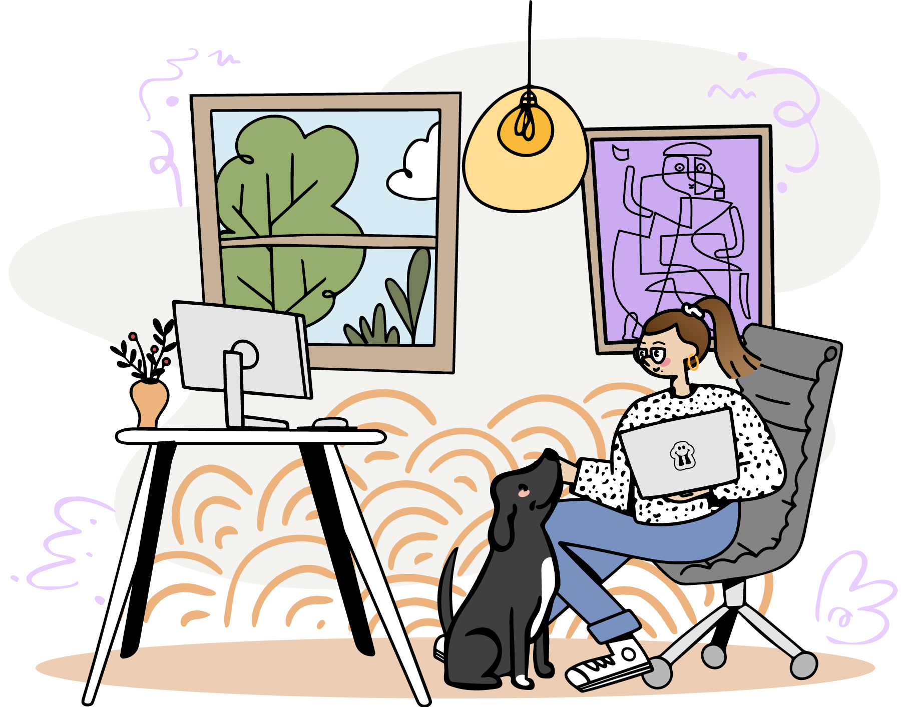

<h1 align="center">Hi ✨dear visitor✨, it's really nice having you here!</h1>

<h3>I'm Marina Terentii ... also known as Artentii.</h3>
  

Professional and enthusiast Graphic and Web Designer with two years of experience in website design and digital graphic communication. My passion for art and design are used as a tool for helping companies market and promote their brand and product.

---

✨ Recent projects you can check out: <a href="https://opentechne.github.io/Discover-Vincent-VanGogh/">Discover Vincent Van Gogh</a>, <a href="https://migalabs.io/">MigaLabs</a>, <a href="https://ethseer.com/">Ethseer</a>, <a href="https://monitoreth.io/">MonitorEth</a> and my <a href="https://www.artentii.com/">portfolio</a>

🐼 Making the coolest designs at <a href="https://github.com/migalabs">MigaLabs</a> & helping out my team

🤲 Beginner mindset (open to learning)

---

<h3>📫 Connect with me: </h3>

<h3>🎨 Check out my work: </h3>

<h3>Design Tools and Languages:</h3>

 
 

